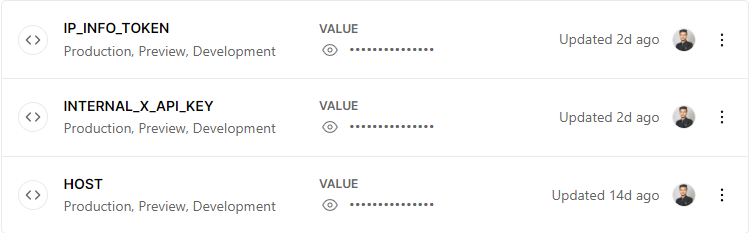

<h2 align="center">API latency testing tool</h2>

<h4 align="center">
    Simple tool for testing endpoint's latency from any location 🗺️
</h4>

Want to find your API endpoints latency from different locations? Use this tool to calculate how your APIs are performing for the users around the world.

> **Note**
>
> General points if you are using this tool for your APIs
>
> -   By using this tool's endpoint, you agree to obey the rate limit of **5 requests/minute** to protect the tool from abuse.
> -   All the tests are done from vercel's server located in **London, United Kingdom (West)**
> -   You can also host this tool on your vercel's account. Check [Self-hosting](#self-hosting) section for this.

## Usage

1.  **Testing your GET endpoint**

    -   `xApiKey` use in below example is optional & only need if your API is private.
    -   Sample request:

        ```js
        const axios = require("axios");

        const options = {
            method: "POST",
            url: "https://api-latency-testing-tool.vercel.app/api/latency",
            headers: {
                "content-type": "application/json",
            },
            data: JSON.stringify({
                url: "https://jsonplaceholder.typicode.com/todos",
                method: "GET",
                // xApiKey: "<your-x-api-key-for-the-above-api-(if-api-is-private)>",
                keepAlive: true,
            }),
        };
        axios
            .request(options)
            .then(function (response) {
                console.log(response.data);
            })
            .catch(function (error) {
                console.error(error);
            });
        ```

    -   Sample response:
        ```json
        {
            "average-latency": "66.4 ms",
            "latency-array": ["73 ms", "54 ms", "75 ms", "72 ms", "58 ms"],
            "total-successful-tests": 5,
            "total-failed-tests": 0,
            "server-info": {
                "what-is-this?": "Server's details on which this api latency testing tool is running.",
                "ip": "18.169.184.150",
                "hostname": "ec2-18-169-184-150.eu-west-2.compute.amazonaws.com",
                "city": "London",
                "region": "England",
                "country": "GB",
                "loc": "51.5085,-0.1257",
                "org": "AS16509 Amazon.com, Inc.",
                "postal": "EC1A",
                "timezone": "Europe/London",
                "download-speed": "14.57 Mbps",
                "upload-speed": "2.31 Mbps"
            }
        }
        ```

2.  **Testing your POST endpoint:**

    (work in progress...)

## Self-hosting

-   By deploying this tool on your Vercel instance, you can customize the region for which you want to test your API by selecting the deployment location on the vercel dashboard.
-   Also, you can avoid rate limits by deploying this tool on your own because by using the above endpoint, you have to handle the rate limit of 5 requests/minute.

    Click on the deploy button to get started! <br />
    [](https://vercel.com/import/project?template=https://github.com/dhyeythumar/api-latency-testing-tool)

### Requirements for Self-hosting

1. You need to signup on [ipinfo](https://ipinfo.io/) (I am using the free tier). I am using this service to collect the server's detailed info on which this tool would be running.
    - Get the token & store it in vercel's environment variables in the settings section as `IP_INFO_TOKEN`.
2. Generate any random string & store it as `INTERNAL_X_API_KEY` in the environment variable.
3. Now add your custom vercel deployment URL as `HOST` in the environment variable.

> Image of my environment variables in vercel
>
> 

## Support the Project

If you are using this project and happy with it or just want to encourage me to continue creating stuff, there are few ways you can do

-   Starring and sharing the project
-   Become a maintainer

If you would like to see a feature implemented, don't hesitate to add it to the issues list.

Contributions are welcome! ✌

## License

Licensed under the [MIT License](./LICENSE).
